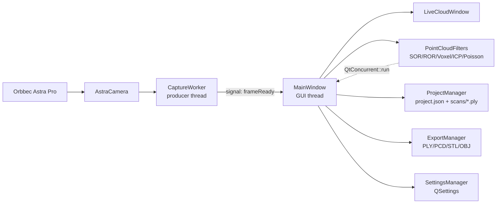

# AstraScanner — 3D-сканер на базе камеры Orbbec Astra Pro

[](https://github.com/Klischa/AstraScanner)
[](https://github.com/Klischa/AstraScanner/blob/main/CMakeLists.txt)
[](https://github.com/Klischa/AstraScanner/actions/workflows/cmake-multi-platform.yml)

**AstraScanner** — настольное приложение для 3D-сканирования на камере **Orbbec Astra Pro** (и совместимых с OpenNI2 устройствах). Захватывает RGB + depth, собирает облако точек в реальном времени, чистит его набором фильтров PCL, склеивает несколько сканов через ICP, строит меш Poisson-реконструкцией и экспортирует результат в **PLY / PCD / STL / OBJ**. Проекты (облака + настройки) сохраняются в виде директории с `project.json` и отдельными `.ply`-сканами.

---

## Основные возможности

| Функция | Описание |
|---------|----------|
| Захват | Одновременный вывод RGB и depth с Astra Pro через OpenNI2 + UVC (OpenCV). Emulation-режим при отсутствии камеры или при сборке с `-DASTRA_ENABLE_OPENNI2=OFF`. |
| Калибровка | По шахматной доске (OpenCV). Интринсики сохраняются вместе с `image_size` и масштабируются под реальное разрешение depth-кадра. |
| Накопление облака | В реальном времени, с паузой, сбросом и индикатором расстояния. |
| Live Cloud Viewer | Отдельное окно `LiveCloudWindow` (`src/gui/LiveCloudWindow.h`) для просмотра текущего облака в реальном времени с настраиваемым интервалом обновления **100–2000 мс** и меню **View → Reset View / Fit to Screen**. |
| Turntable mode | Режим «поворотный стол» на вкладке «Сканирование»: задаются интервал (сек) и число сканов, по таймеру текущее облако автоматически сохраняется как отдельный скан проекта и накопитель очищается. |
| Фильтры | SOR (Statistical Outlier Removal), ROR (Radius Outlier Removal), Voxel Grid, «Magic Wand» (Voxel + SOR). |
| Lasso selection | Ручное удаление / сохранение точек облака через лассо-выделение прямо в VTK-вьюере (`LassoSelector`, `src/gui/LassoSelector.h`). Контур рисуется живьём, Esc отменяет выделение, поддерживается undo (до 10 шагов). Добавлено в PR [#7](https://github.com/Klischa/AstraScanner/pull/7) и [#8](https://github.com/Klischa/AstraScanner/pull/8). |
| Нормали | `pcl::NormalEstimationOMP` (многопоточно) с поддержкой как radius search (`normalSearchRadius`), так и k-nearest (`kNearest`). View-point по умолчанию берётся как центроид облака минус 1 м по Z; можно задать опциональный custom view-point (X/Y/Z) и флаги «Инвертировать нормали» / «Согласованная ориентация (BFS по k-соседям)». |
| Poisson-реконструкция | `pcl::Poisson` с полным набором параметров: `depth`, `minDepth`, `pointWeight`, `samplesPerNode`, `scale`, `confidence`, `outputPolygons`, `normalSearchRadius`, `kNearest`. Меш рисуется в том же VTK-виджете. |
| ICP-регистрация | `pcl::IterativeClosestPoint` попарно по сканам проекта, c параметрами `maxCorrespondenceDistance` / `maxIterations`, опциональной децимацией результата через voxel-grid и режимом «skip non-converged». |
| Проект | `ProjectManager`: директория с `project.json` (`formatVersion=1`) + `scans/*.ply`, add / remove / rename / ленивая загрузка сканов. |
| Экспорт | `ExportManager`: облака — PLY (бинарный, с цветом) или PCD; меш — PLY / STL / OBJ. Автодетект формата по расширению. |
| Диалог настроек | GUI-диалог «Настройки → Параметры…» (`Ctrl+,`, `SettingsDialog`) собирает все параметры `QSettings` (сканирование, фильтры, ICP, Poisson, пути) в одно окно с OK / Cancel / Apply / Reset to defaults. |
| Настройки | `SettingsManager` (QSettings) — хранит параметры ICP / Poisson / фильтров / директории экспорта и проектов между запусками. |
| Асинхронные операции | Poisson и ICP-merge выполняются в `QtConcurrent::run` + `QFutureWatcher`, GUI не блокируется. |
| Логирование | Qt `messageHandler` → `logs/scanner.log` + отдельная вкладка «Логи» в GUI. |

---

## Системные требования

| Компонент | Минимум |
|-----------|---------|
| ОС | Windows 10 / 11 (x64); экспериментально Linux / macOS в **emulation-only** режиме (`-DASTRA_ENABLE_OPENNI2=OFF`). |
| Тулчейн | Visual Studio 2022 (MSVC v143) / GCC / Clang, CMake 3.22+, Ninja опционально. |
| Стандарт C++ | C++17 (`set(CMAKE_CXX_STANDARD 17)` в `CMakeLists.txt`). |
| Qt | Qt 6 (модули `Core`, `Widgets`, `OpenGL`, `Concurrent`). |
| PCL | **PCL ≥ 1.15** (`find_package(PCL 1.15 REQUIRED ...)`), компоненты `common io visualization filters registration features surface`. |
| VTK | `CommonCore`, `FiltersSources`, `InteractionStyle`, `RenderingOpenGL2`, `RenderingQt`, `GUISupportQt`. |
| OpenCV | 4.x. |
| CPU | Intel Core i5 / AMD Ryzen 5. |
| ОЗУ | 8 ГБ (16 ГБ рекомендуется для Poisson-реконструкции). |
| GPU | OpenGL 3.2+. |
| Камера | Orbbec Astra Pro (или другая OpenNI2-совместимая). Опционально — только на Windows. |
| OpenNI2 | 2.3+ (в составе Orbbec SDK), опционально. |

---

## Зависимости и сборка

### 1. vcpkg

```bat
git clone https://github.com/Microsoft/vcpkg.git C:\dev\vcpkg
C:\dev\vcpkg\bootstrap-vcpkg.bat
C:\dev\vcpkg\vcpkg integrate install
```

### 2. Библиотеки через vcpkg

```bat
vcpkg install qt6-base qt6-opengl qt6-concurrent opencv4 pcl[core,visualization,surface,registration] vtk
```

> Нужны **PCL ≥ 1.15** с компонентами `common io visualization filters registration features surface` (последний — для Poisson) и Qt-модули `Core Widgets OpenGL Concurrent`.

### 3. OpenNI2 SDK (опционально)

Поддержка камеры Astra Pro требует OpenNI2 SDK и Orbbec-драйверов, которые официально поставляются только для Windows. На других платформах (или при отсутствии SDK) собирайте с `-DASTRA_ENABLE_OPENNI2=OFF` — `AstraCamera` будет отдавать синтетические кадры, остальная функциональность (фильтры, ICP, Poisson, импорт/экспорт, проект) работает без изменений.

Скачайте Orbbec OpenNI2 SDK и распакуйте, например, в `C:\orbbec\OpenNI_2.3.0.86_...\Win64-Release\sdk`.

### 4. Сборка

CMake принимает переопределения через `-D` или переменные окружения:

| Переменная | Назначение | Значение по умолчанию |
|------------|------------|-----------------------|
| `CMAKE_TOOLCHAIN_FILE` или `VCPKG_ROOT` | Тулчейн vcpkg | `C:/dev/vcpkg/...` |
| `OPENNI2_ROOT` | Корень OpenNI2 SDK | `C:/orbbec/OpenNI_2.3.0.86_.../sdk` |
| `VCPKG_INSTALLED_DIR` | Префикс установленных пакетов vcpkg (для post-build копирования DLL) | `C:/dev/vcpkg/installed/x64-windows` |
| `ASTRA_ENABLE_OPENNI2` | Сборка с поддержкой OpenNI2 | `ON` на Windows, `OFF` на Linux/macOS |

Сборочные примечания:

- `NOMINMAX` определяется автоматически в `CMakeLists.txt` (`add_definitions(-DNOMINMAX)`), отдельно его задавать не нужно.
- В `main.cpp` принудительно выставляется переменная окружения `OPENCV_VIDEOIO_PRIORITY_MSMF=0` до первой инициализации `cv::VideoCapture` — это отключает Media Foundation backend у OpenCV и стабилизирует захват UVC-потока Astra Pro.

```bat
git clone https://github.com/Klischa/AstraScanner.git
cd AstraScanner
cmake -B build -S . ^
  -DCMAKE_TOOLCHAIN_FILE=C:/dev/vcpkg/scripts/buildsystems/vcpkg.cmake ^
  -DOPENNI2_ROOT=C:/orbbec/OpenNI_2.3.0.86_.../Win64-Release/sdk ^
  -DCMAKE_BUILD_TYPE=Release
cmake --build build --config Release
```

Кросс-платформенная сборка на Linux/macOS (emulation-only):

```bash
git clone https://github.com/Klischa/AstraScanner.git
cd AstraScanner
cmake -B build -S . -DCMAKE_BUILD_TYPE=Release -DASTRA_ENABLE_OPENNI2=OFF
cmake --build build --config Release
```

Исполняемый файл окажется в `build/Release/AstraScanner.exe` (Windows) или `build/AstraScanner` (Linux/macOS). Post-build-шаги CMake копируют рядом `OpenNI2.dll`, драйверы OpenNI2, Qt-плагин `platforms/` и runtime-DLL из vcpkg.

---

## Архитектура

Producer-consumer модель: отдельный поток захвата отдаёт готовые кадры в GUI-поток через Qt-сигналы, после чего MainWindow распределяет данные по визуализаторам, фильтрам и менеджерам.



---

## Структура исходников

```
src/
├── main.cpp                     — точка входа, настройка message handler-а и OPENCV_VIDEOIO_PRIORITY_MSMF=0
├── capture/                     — AstraCamera (OpenNI2+UVC), CaptureWorker (поток захвата)
├── calibration/                 — CameraCalibrator (шахматная доска → intrinsics)
├── filters/                     — PointCloudFilters (SOR/ROR/Voxel/MagicWand, ICP merge, Poisson, NormalEstimationOMP)
├── settings/                    — SettingsManager (QSettings-обёртка, singleton)
├── export/                      — ExportManager (PLY/PCD/STL/OBJ)
├── project/                     — ProjectManager (project.json + scans/*.ply)
└── gui/                         — MainWindow, LiveCloudWindow, SettingsDialog, LassoSelector (QVTKOpenGLNativeWidget)
```

Runtime-директории, создаваемые автоматически при работе приложения:

```
data/                            — camera_calibration.xml (интринсики после калибровки)
projects/                        — директория проектов по умолчанию
logs/                            — scanner.log (ротации нет, дописывается)
```

---

## Использование

### Вкладки GUI

Главное окно содержит **6 вкладок**:

1. **Главная** — информация о камере, настройки отображения, индикатор расстояния (read-only), кнопка **«📊 Live Cloud Viewer»** для открытия отдельного окна `LiveCloudWindow` с живой визуализацией облака.
2. **Сканирование** — preview / scan / pause / stop / clear, индикатор расстояния, кнопки экспорта текущего облака, группа **«Режим поворотный стол»** (интервал в секундах, число сканов).
3. **Калибровка** — захват кадров шахматной доски, калибровка, сохранение интринсик в `data/camera_calibration.xml`.
4. **Обработка** — фильтры (SOR / ROR / Voxel / Magic Wand), Poisson-реконструкция со всеми параметрами (`depth`, `minDepth`, `pointWeight`, `samplesPerNode`, `scale`, `normalSearchRadius`, `kNearest`, ориентация нормалей), ICP-мерж всех сканов проекта, группа **«Ручное редактирование (лассо)»** с кнопками «Удалить выделенное» / «Оставить только выделенное» / «Отменить правку».
5. **Проект** — список сканов проекта, контекст-меню (загрузить, переименовать, экспорт, удалить), кнопка «Добавить текущее облако как скан».
6. **Логи** — живой вывод Qt message handler-а (тот же, что пишется в `logs/scanner.log`).

### Live Cloud Viewer

Отдельное окно `LiveCloudWindow` открывается кнопкой «📊 Live Cloud Viewer» на вкладке «Главная». Функции:

- Независимая интерактивная VTK-сцена с trackball-камерой.
- Меню **View**: *Reset View* (переинициализировать камеру) и *Fit to Screen*.
- Таймер обновления с настраиваемым интервалом **100–2000 мс** (спинбокс `Update interval (ms)`), кнопки **Start Live View / Stop**.

### Меню

- **Файл** → Новый проект / Открыть / Сохранить / Сохранить как.
- **Экспорт** → Экспорт текущего облака (PLY / PCD), Экспорт меша (PLY / STL / OBJ).
- **Настройки** → Параметры… (`Ctrl+,`) — диалог со всеми ключами `SettingsManager`, OK / Cancel / Apply / Reset to defaults.

### Первый запуск и калибровка

1. Подключите Astra Pro к USB 3.0.
2. Запустите `AstraScanner.exe`.
3. Вкладка «Калибровка» → `Preview` → выставите шахматную доску, «Захватить кадр» минимум 5 раз с разных ракурсов.
4. «Калибровать». При RMS-ошибке ≤ 2 px интринсики сохраняются в `data/camera_calibration.xml`; при бо́льшей ошибке выводится предупреждение.

### Сканирование

- **Preview** — только видеопотоки.
- **Scan** — начать накопление облака. Двигайте камеру / объект.
- **Pause / Stop / Clear** — соответственно.
- **Режим поворотный стол** — включите чекбокс «Включить», задайте интервал и число сканов; каждое срабатывание таймера сохранит текущее облако как отдельный скан проекта и очистит накопитель.

### Работа с проектом

1. **Файл → Новый проект**, выберите директорию.
2. На вкладке «Проект» добавьте текущее облако кнопкой «Добавить текущее облако как скан».
3. Каждый скан лежит в `project_dir/scans/<name>.ply`, метаданные — в `project.json`.

### Фильтрация

На вкладке «Обработка»:

- **SOR** — удаляет выбросы. Дефолты из `SettingsManager`: `meanK=50`, `stddevMul=1.0`.
- **ROR** — требует минимум соседей в радиусе. Дефолты: `radius=0.02 м`, `minNeighbors=5`.
- **Voxel Grid** — прореживает облако. `leafSize=0.005 м` (дефолт, выставляемый из GUI при ручном прореживании) / `0.002 м` (`SettingsManager::voxelLeafSize` — используется турtable/ICP-пайплайном по умолчанию).
- **Magic Wand** — Voxel + SOR одним нажатием.

Параметры по умолчанию читаются из `SettingsManager` и перезаписываются при каждом изменении.

### Ручное редактирование лассо

На вкладке «Обработка» → **«Ручное редактирование (лассо)»**: зажмите ЛКМ и обведите курсором контур прямо во вьюере, затем нажмите **«Удалить выделенное»** или **«Оставить только выделенное»**. Контур отрисовывается живьём поверх VTK-сцены, `Esc` отменяет текущее выделение, кнопка **«Отменить правку»** возвращает предыдущий снимок облака (undo до 10 шагов).

### ICP-мерж сканов

1. Добавьте в проект **минимум 2** скана.
2. Вкладка «Обработка» → группа «Регистрация сканов (ICP)». Параметры:
   - `maxCorrespondenceDistance` (м, по умолчанию `0.05`) — максимальное расстояние между соответствующими точками.
   - `maxIterations` (по умолчанию `50`) — число итераций ICP на паре.
   - `skipNonConverged` (по умолчанию `false`) — если ICP не сошёлся, пропустить скан (иначе добавляется без трансформации).
   - `voxelLeafOut` (м, по умолчанию `0.0`) — опциональная децимация результата voxel-grid'ом; `0` — без децимации.
3. «Объединить все сканы проекта». ICP попарно выравнивает каждый последующий скан с накопленным результатом; прогресс логируется.
4. «Сохранить результат в проект…» — создать новый скан из склеенного облака.

### Poisson-реконструкция

1. Облако должно быть предварительно очищено (SOR / Voxel). Нормали оцениваются автоматически через `pcl::NormalEstimationOMP` (многопоточно). View-point по умолчанию устанавливается как **центроид облака минус 1 м по Z**; можно переопределить custom view-point в GUI.
2. Группа «Реконструкция поверхности (Poisson)», полный список параметров:

   | Параметр | Дефолт | Описание |
   |----------|--------|----------|
   | `depth` | `9` (диапазон 5–12) | максимальная глубина octree. |
   | `minDepth` | `5` | минимальная глубина octree. |
   | `pointWeight` | `4.0` | screened-вариант Poisson; `0` — classic Poisson. |
   | `samplesPerNode` | `1.5` | минимум точек на узел. |
   | `scale` | `1.1` | масштаб bounding-box вокруг облака. |
   | `confidence` | `false` | использовать длину нормали как confidence-вес. |
   | `outputPolygons` | `false` | выдавать полигоны «как есть» без триангуляции. |
   | `normalSearchRadius` | `0.01 м` | радиус для `NormalEstimationOMP`; `0` → переключиться на k-nearest. |
   | `kNearest` | `20` | число соседей для `NormalEstimationOMP`, если `normalSearchRadius=0`. |

3. Подсекция **«Ориентация нормалей»**: чекбоксы «Инвертировать нормали», «Согласованная ориентация (BFS по k-соседям)», ручной ввод `custom view-point (X/Y/Z, м)`. Для сильно замкнутых объектов эти флаги позволяют исправить «вывернутый наизнанку» меш без пересканирования.
4. «Построить меш» → меш появляется в VTK-вьюере. Реконструкция идёт в фоновом потоке с прогресс-баром.
5. **Экспорт меша** (меню «Экспорт» или кнопка) → PLY / STL / OBJ. До построения меша кнопка сообщит, что меш пуст.

---

## Параметры SettingsManager

`SettingsManager` (`src/settings/SettingsManager.cpp`) — QSettings-обёртка (singleton), хранит ключи между запусками. Хранилище: **реестр Windows** (`HKCU\Software\AstraScanner\AstraScanner`) или **`~/.config/AstraScanner/AstraScanner.conf`** на Unix.

| Ключ | Дефолт | Назначение |
|------|--------|------------|
| `scan/timeoutSec` | `300` | Таймаут сканирования (сек). |
| `scan/voxelLeafSize` | `0.002` | Размер вокселя для фонового прореживания (м). |
| `scan/frameSkip` | `3` | Пропуск кадров при накоплении облака. |
| `filters/sorMeanK` | `50` | SOR: число соседей. |
| `filters/sorStddevMul` | `1.0` | SOR: множитель стандартного отклонения. |
| `filters/rorRadius` | `0.02` | ROR: радиус поиска (м). |
| `filters/rorMinNeighbors` | `5` | ROR: минимум соседей. |
| `icp/maxCorrespondenceDistance` | `0.05` | ICP: максимальное расстояние между соответствиями (м). |
| `icp/maxIterations` | `50` | ICP: число итераций. |
| `icp/skipNonConverged` | `false` | Пропускать ICP-пары, которые не сошлись. |
| `icp/voxelLeafOut` | `0.0` | Децимация результата ICP через voxel-grid (м; `0` — выкл). |
| `poisson/depth` | `9` | Poisson: максимальная глубина octree. |
| `poisson/pointWeight` | `4.0` | Poisson: вес screened-члена. |
| `poisson/samplesPerNode` | `1.5` | Poisson: минимум точек на узел. |
| `poisson/normalRadius` | `0.01` | Poisson: радиус `NormalEstimationOMP` (`0` → k-nearest). |
| `poisson/kNearest` | `20` | Poisson: число соседей для `NormalEstimationOMP`. |
| `paths/projectsDirectory` | `./projects` (рядом с exe) | Директория проектов по умолчанию. |
| `paths/lastExportDirectory` | `Documents` (`QStandardPaths::DocumentsLocation`) | Последний выбранный путь экспорта. |

Все ключи доступны в GUI через диалог **«Настройки → Параметры…»** (`Ctrl+,`) с кнопкой **Reset to defaults**.

---

## Формат проекта

Директория проекта содержит `project.json` и подкаталог `scans/` с отдельными `.ply`-файлами (бинарный PLY с цветом).

Структура `project.json` (`formatVersion=1`, писатель — `src/project/ProjectManager.cpp`):

```json
{
  "name": "MyProject",
  "formatVersion": 1,
  "scans": [
    {
      "name": "Scan 1",
      "file": "scans/scan_20260422_123456789.ply",
      "createdAt": "2026-04-22T12:34:56",
      "pointCount": 50000
    }
  ]
}
```

Поля `ScanItem`:

- `name` — отображаемое имя скана.
- `file` — относительный путь к PLY внутри директории проекта.
- `createdAt` — ISO-8601 timestamp.
- `pointCount` — число точек (заполняется при сохранении скана на диск).

Облака загружаются лениво: при открытии проекта `ProjectManager` читает только метаданные, сами PLY подгружаются по требованию.

---

## Проверка исходников

```powershell
.\test.ps1
```

Скрипт проверяет:

- наличие ключевых исходных файлов (`CMakeLists.txt`, `src/main.cpp`, `src/gui/MainWindow.cpp`, `src/capture/AstraCamera.cpp`, `src/calibration/CameraCalibrator.cpp`, `src/filters/PointCloudFilters.cpp`, `src/export/ExportManager.cpp`, `src/settings/SettingsManager.cpp`);
- наличие исполняемого файла в одном из двух путей: `build\Release\AstraScanner.exe` или `out\build\Release\Release\AstraScanner.exe`;
- наличие директорий `data/` и `projects/`;
- наличие `logs/` и log-файлов внутри.

Прогон полной сборки и тесты железа — только на Windows с подключённой Astra Pro.

Кросс-платформенная CI-сборка (Ubuntu + Windows, GCC/Clang/MSVC) настроена в [`.github/workflows/cmake-multi-platform.yml`](.github/workflows/cmake-multi-platform.yml) и запускается автоматически на push/pull request в `main`.

---

## Известные ограничения

- **Полная поддержка камеры Astra Pro — только Windows.** Стэк MSVC / OpenNI2 SDK / проприетарные драйверы Orbbec работает только на Windows. На Linux / macOS проект собирается и запускается в **emulation-only режиме** (синтетические кадры) через `-DASTRA_ENABLE_OPENNI2=OFF`; все фильтры, ICP, Poisson, экспорт и работа с проектом полностью функциональны. Кросс-платформенная CI-сборка проверяется workflow `cmake-multi-platform.yml`.
- **Поворотный стол.** Реализован упрощённый режим на вкладке «Сканирование» (группа «Режим поворотный стол»): задаётся интервал и число сканов, по таймеру текущее облако автоматически сохраняется в проект и накопитель очищается. Калиброванной механической платформы по-прежнему нет — ICP-мерж из произвольных ракурсов запускается отдельной кнопкой на вкладке «Обработка».
- **Нет встроенной пост-обработки цвета и текстурирования меша** — Poisson-реконструкция работает только с геометрией; цвет вершин берётся из ближайшей точки облака при экспорте.
- **Нет автоматического определения петли (loop closure)** при ICP-мерже большого числа сканов — попарная регистрация накапливает дрейф.

---

## Лицензия

Проект распространяется под **Creative Commons Attribution-NonCommercial-ShareAlike 4.0 International (CC BY-NC-SA 4.0)**.

- Можно использовать, модифицировать и распространять бесплатно в личных, образовательных, исследовательских целях.
- Запрещено любое коммерческое использование (продажа ПО, платные услуги 3D-сканирования, интеграция в коммерческие продукты) без письменного разрешения автора.

Полный текст: [LICENSE.MD](https://github.com/Klischa/AstraScanner/blob/main/LICENSE.MD).

---

## Вклад в проект

1. Форкните репозиторий.
2. Создайте ветку: `git checkout -b feature/my-change`.
3. Закоммитьте изменения: `git commit -m 'Add my change'`.
4. Откройте pull request.

---

## Контакты

- Автор: klischa@yandex.ru
- Репозиторий: <https://github.com/Klischa/AstraScanner>
- Баги / предложения: <https://github.com/Klischa/AstraScanner/issues>
